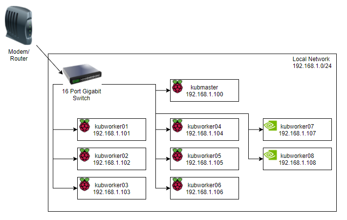

# RPi/Nano Kubernetes Cluster Networking

Piraeus on Docker in Kubernetes on Ubuntu Linux on RPi Cluster

## Notes

Kubernetes likes static IP addresses and while there are ways to get around that requirement, it is an assumption that static IP addresses will be used.  They are entered into the "inventory" file for Ansible to use.

- Raspberry Pi: https://www.raspberrypi.org/documentation/configuration/wireless/wireless-cli.md
- Jetson Nano: [Adding WiFi to the NVIDIA Jetson](https://www.bing.com/search?FORM=U527DF&PC=U527&q=Jetson+nano+wifi+setup)

## Assumptions

The cluster used to create the process and script was hard-wired to the network.  WiFi can be used and would be a slightly simpler configuration but the description below assumes a hard-wired network.

## Description of Development Cluster

The cluster used in the development of the Ansible installation scripts is as follows:  Basic 192.168.#.0/24 256 address space network.  The modem/router operates with WiFi and hard-wire connections.  Each of the Raspberry Pi's and NVidia Jetson Nano's were added to the network configured with a static IP address so that they would be assigned the same address every time they boot up.  This made creation of the cluster via Kubernetes that much easier.

In between the main router and the cluster is a 16-port Gigabit switch.  A single ethernet connection carried data to the switch where it is then routed directly to the appropriate ARM device.

Summary:  The cluster concists of a single Kubernetes master, 6 Raspberry Pi 4 workers and 2 NVidia Jetson Nano's.

Hardware Configuration:
1 Raspberry Pi 4 (2 GB RAM) (Master)
4 Raspberry Pi 4 (4 GB RAM) (Workers)
2 Raspberry Pi 4 (8 GB RAM) (Workers)
2 NVidia Jetson Nano (4 GB RAM - 128 GPU)

